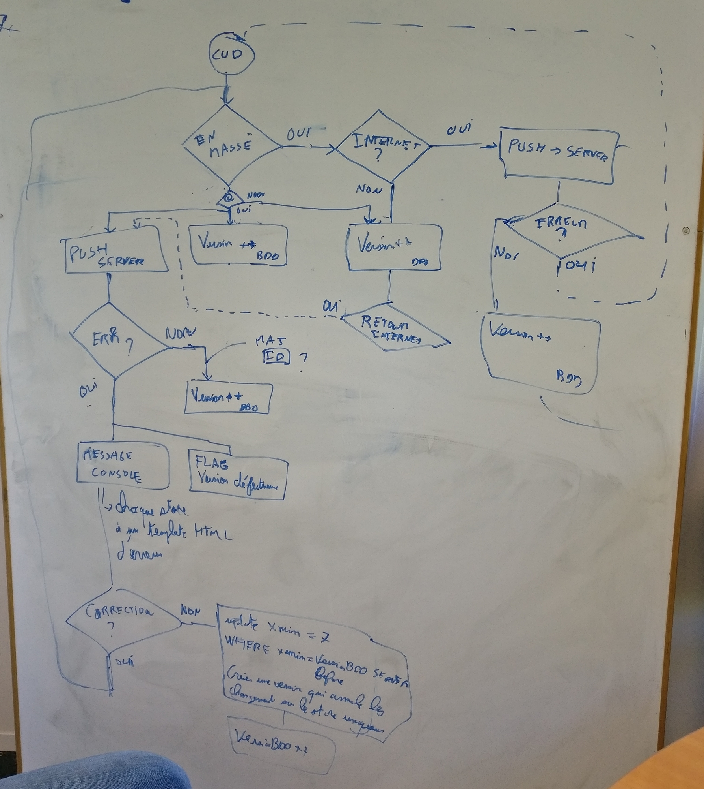
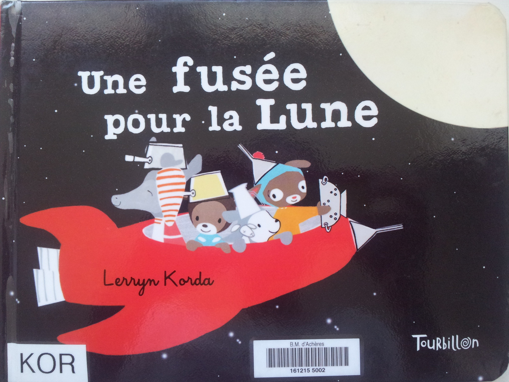

# Projet Lunaris

« Il faut toujours viser la lune, car même en cas d’échec, on atterrit dans les étoiles »
-- Oscar WILDE

Lunaris est la traduction de lunaire en latin. 


# Humour Question / Réponses

- "Etre dans la lune" ne peut plus être un défaut. Cela démontre une vraie volonté d'améliorer la productivité de l'entrerpise !
- On sera bien luné grâce à Lunaris
- Nos clients vont tous tomber de la lune en voyant le résultat
- Enfin, on y verra clair de lune dans le code
- Nous avons qu'une lune de miel (1 mois)  pour concrétiser ce projet
- Il va falloir décrocher la lune car le projet parait impossible
- Faudra pas non plus demander la lune, aucune solution n'est parfaite
- La lune, ça parait loin, et pourtant c'est tout proche

# Recherches

- [Comparatif : Vuejs, React, Angular](https://docs.zoho.com/file/5j7aqe18432a5e6a9410da9968cd88667ef92)
- [Réponses questionnaires](https://docs.zoho.com/file/5mzbl8e23756df50b499cbf4fcc73f968988b)

#### Comment communiquer entre le serveur (model) et les objet vueUS

Si on a notre propre système de base de données coté client, comment pousser les data à VueJS :
 - via les props : binding model -> vue à priori possible. Quid du binding vue -> model ? 
 - via un require + une fonction dans data {} : binding model -> vue à priori possible. Quid du binding vue -> model ? 
 - via un plugin (un peu comme VueX this.$store.state.todos...) et les computed : le binding model -> vue  serait à priori ok. il faut cependant définir toutes les 
   `computed` pour chaque champ du formulaire. VueJS résoud les dépendances et ne recalcul pas si la dépendance n'a pas changé. 
   Comment VueJS est au courant d'une mise à jour ? A priori, il instrumente le this par des getters/setter ? Mystère...
   Le binding vue -> model doit être fait la main via les mutations.
   
```html
    <div id="app1">
      {{ test2 }}

      <button @click="update">+</button>
    </div>
    <div id="app2"></div>
    <script>
        var store = {
        _vm : new Vue({
          data : {
            $$state : {
              test : 1
            }
          }
        }),
        install : function (Vue, options) {
          Vue.mixin({ 
            beforeCreate: function () {
              this.$store = {
                get state () {
                  return store._vm.$data.$$state;
                }
              }
            } 
          });
        }
      };

      Vue.use(store);

      var vm = new Vue({
        el : '#app1',
        data : {
          test : 1
        },
        computed : {
          test2 : function () {
            return this.$store.state.test;
          }
        },
        methods : {
          update : function () {
            this.$store.state.test++;
          }
        }
      });
    </script>
```

- pour le cas des inventaire, comment lunaris est au courant de la mise à jour de l'input directement sur la collection ?
  - on peut faire une method '@onBlur' , qui passe l'id de l'objet... Et dans le model vue, on peut appeler lunaris et lui dire de faire la mutation.
  - par contre, cela veut la liste des porduit de l'invetaire ne peut pas être dans Vue.data car Vue le mettrait à jour en direct.


Utiliser Vuex : 
 - malgré tout : beaucoup de chose fait main (validation formulaire, aggrégat). Le model doit être définit 2 fois (dans data et dans le store VueX). Car toute modif dans le store VueX doit être fait 
   par une fonction de mutation, du coup vue ne peut pas mettre à jour directement le store.


#### Validation des Formulaire (comment retourner l'erreur en live ) :
 - dans vue par défaut, il faut faire à la main
 - https://monterail.github.io/vuelidate/#getting-started Vuelidate appporte un peu de souplesse mais il faut définir les phrase d'erreur dans l'HTML
 - http://vee-validate.logaretm.com/ est un peu mieux mais les règle des validation (required, ...) sont directement dans l'HTML
 - pour éviter de répeter dans l'html le label, input, error... Peut-être pouvons passer par des `slot`  ou des composants.


Comment gérer les erreurs asynchrore ?

 Imaginons, l'utilisateur est déconnecté du réseau, il créé une famille de produit, puis un produit, puis l'ajoute dans son inventaire. 
  il quitte l'écran des inventaire. Au retour du réseau, on lui informe que le serveur n'a pas pu enregistrer la famille de produit pour 
  une raison technique, du coup, tout le reste ne peut pas être enregistré.. Que faire ?
  
 Si nos models clients-serveur sont bine synchronisé,  à priori, cela doit être rare.
 Dnas tous les cas, le client ne doit pas perdre son inventaire.
 Il est informé via des message clair (global à l'application) que la famille X n'a pas pu être enregistré, donc le produit Y n'a pas pu être créé, donc l'inventire Y n'a pas pu être enregistré.
 Le support n1 peut accéder à ces logs.
 L'utilisateur peut lui-même revenir dans l'écran des inventaire ou des produit et corriger ou appeler le support pour se faire aider.
 
Conséquence technique  : 
  - il faut dans le model définir dans les objet les champs pertinent à afficher en cas d'erreur pour que l'utilisateur puisse revenir dessus (par exemple, le label et l'id du produit)
  - il faut traduire le nom des tables pour parler en français...
  - on pourrait désigner une URL pour retourner directement vers le formulaire
 
Concrêtement, pour que l'errreur s'affiche automatiqement à coté de l'input dans le formulaire, il y a 2 technique possibles: 

 - soit le model Lunaris contient un champ erreur pour chaque champ défini. Cela permet à VueJS de binder ce champ et de l'afficher si il change après validation 
   du model par Lunaris

```
{
    id : 1
    id_error : ''
    label : 'sdqs' 
    label_error : ''
}
```
  - Soit il y a un système d'erreur global avec une URL pour décrire quel champ est en erreur 'MyProductList[id=1].family.label`. Cette clé peut être utilisée comme 
    identifiant à la fois coté HTML et coté validation pour afficher ou non l'erreur. Problème  : pas facile à générer coté VueJS


#### Scroll infini


Aucune solution trouvée ne gère parfaitement ces 3 points à la fois:
- scroll infini d'élement dont la hauteur a une taille variable
- maintient d'un DOM légé (retrait des élements du DOM supérieur)
- performance (pas lecture de la hauteur des item par exemple)

Un exemple : 

https://akryum.github.io/vue-virtual-scroller/

Notre version :  https://git.ideolys.com/ideolys/vuejs-nickel/tree/master/CIR/scroll

# Pourquoi on utilise pas un truc à la Babel ?

Parce qu'on a trouvé plus performant (bublé) : https://buble.surge.sh/guide/#faqs


#### quelques concepts

- il faut toujours écrire la requête SQL, même le générateur (pout gerer les _labelSearchIndex, sites). La rendre la plus dynamique.
- synhroniser les champs qui dépendent du même nom SQL (sum list-header avec l'objet complet par exemple)
- décrire les filtres qui ne sont pas présent dans la map (ex withAllChildren, etc...)

#### Versionning des données

- Utilisation d'un numéro de version pour chaque objet de la collection pour déterminer son état (à la Postgres). Un objet peut être être présent plusieurs fois dans la collection, 
mais il possèdera plusieurs numéros. Lunaris conservera le numéro courant pour connaître la version à utiliser.
- Une mise à jour s'effectue "en masse" sur toutes les données de la base lorsque l'appli est connectée à internet. Sinon, seule les données locales sont modiifiées.
- Chaque store possède un template d'erreur qui s'affiche si erreur HTTP il y a.



# Lecture conseillée

Toute l'équipe, en avant  !

