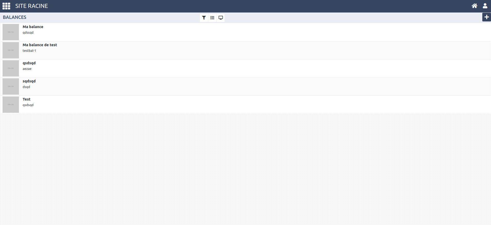
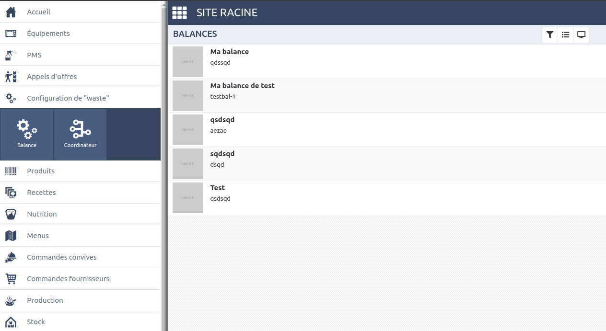
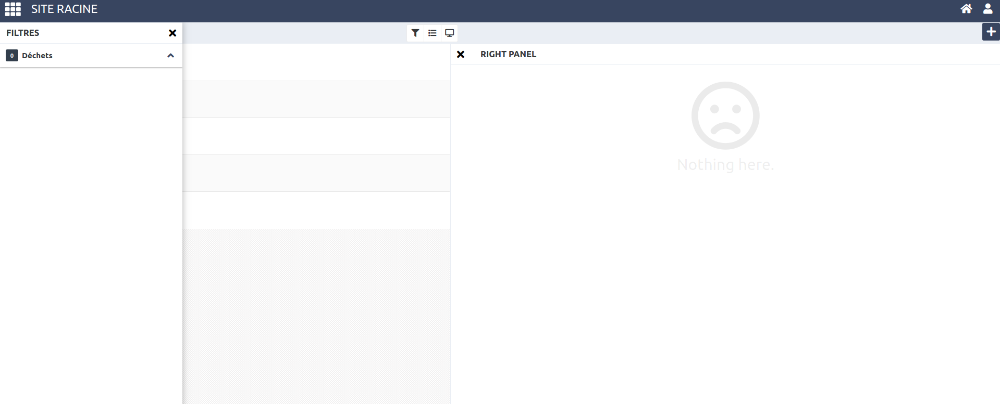

# Découvrons la V2

Nous allons donc ensemble découvrir la v2 et l'écran que nous allons créer en image.

* Ecran complet.

* Menu principal ouvert

* Panneaux droite et gauche

## Suite

[L'aventure commence vraiment ici !](part2.md)