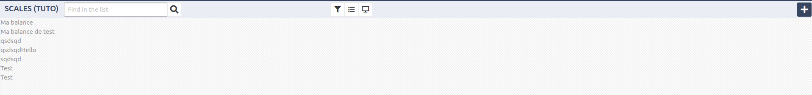
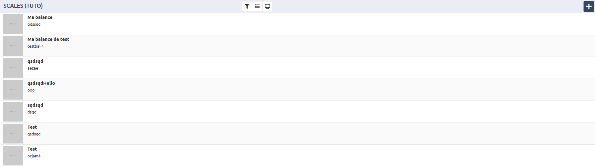
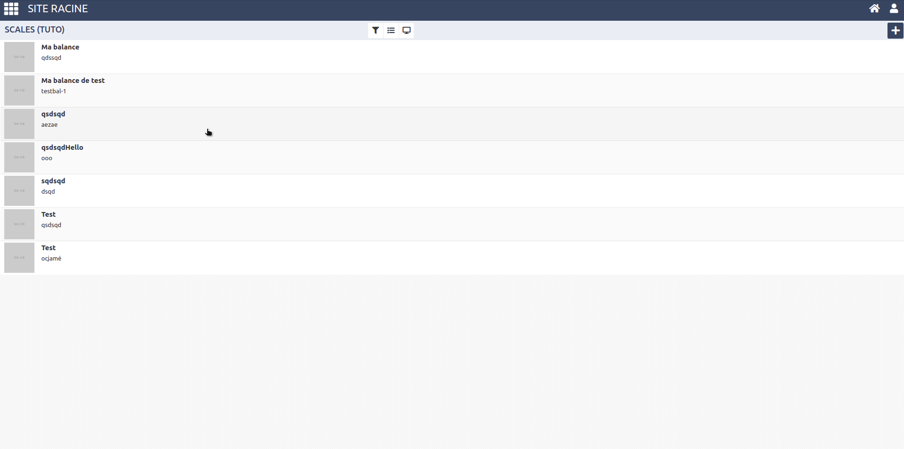
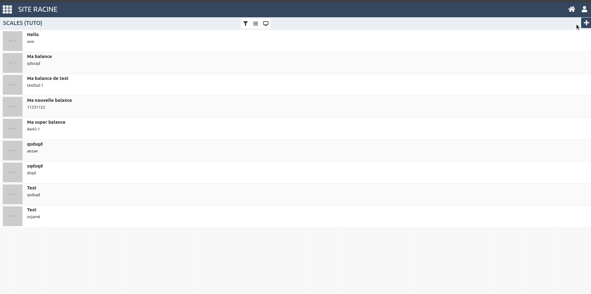
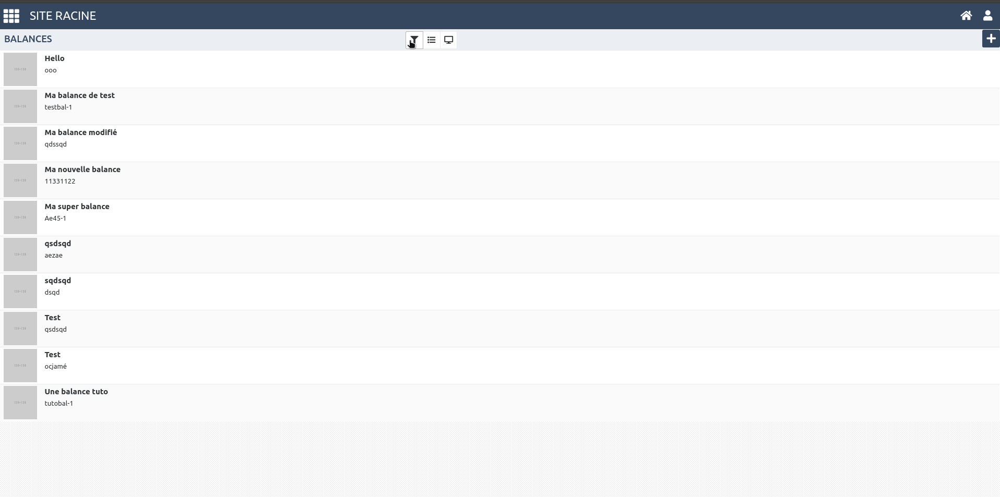

# Continuons cet écran

**Pour la suite il faudra bien penser à préfixer tous les noms de modules / stores par tuto, pour éviter tous conflits avec l'écran existant**

## Parties

1. [Ecran actuel](#ecran-actuel)
2. [Ameliorer l'affichage des balances](#améliorer-l'affichage-des-balances)
3. [Ouvrir le panneau de droite avec les infos de base de la balance](#ouvrir-le-panneau-de-droite-avec-les-infos-de-base-de-la-balance)
4. [Modifier et créer une balance](#modifier-et-créer-une-balance)
5. [Ajouter un filtre](#ajouter-un-filtre)

**[Quelques protips](#quelques-protips)**

## Ecran actuel



## Personaliser la barre de "header"

**Tous d'abord, nous allons retirer la barre de recherche placée en haut**

Pour cela il va falloir rajouté un élément dans la balise `<layout>` de notre vue.

*Fichier:* **index.html**
```html
<layout ref="scales-res"
  v-bind:isNoHeaderSearchInput="true">
```

## Améliorer l'affichage des balances

*Votre prochaine mission seras de faire que la liste des balances ressemble à cela*



*Pour cela je vous invite à lire la doc bulma / buefy*

* **[Doc bulma](https://bulma.io/documentation/)**
* **[Doc buefy](https://buefy.github.io/#/documentation)**

## Ouvrir le panneau de droite avec les infos de base de la balance

### **Dans le controller**


Pour commencer il faudras définir votre ref dans votre controller

*Fichier:* **index.js**
```js
module.exports = {
  ...
  created : function () {
    this.$refs.scalesRef = {};
    ...
  }
  ...
}

```

Aussi vous aurez besoins de partager des données entre votre vue et votre controller pour celà il faudra ajouter un fonction data dans votre controller

***exemple:***
```js
module.exports = {
  ...
  data : function () {
    return {
      key : 'value'
    }
  }
  ...
}
```

*Les élément retourné dans cette fonction seront partagés avec la vue*

aussi vous aurez besoins de méthodes.

***exemple:***
```js
module.export = {
  ...
  methods : {
    nomDeLaMethode : function (arguments) {
      ...
    }
  }
  ...
}
```

Et pour ouvrir le panneau de droite il suffis d'appeler la fonction suivante

```js
this.$refs.scalesRef.openRightPanel();
```

### **Dans la vue**

Le slot pour le panneau de droite sont les suivants:

* right-panel-header-title
* right-panel-body-content
* right-panel-footer-content

### **Résultat attendu**

Le resultat attendu est le suivant:



## Modifier et créer une balance

Notre prochaine objectif est de pouvoir créer / modifier une balance

### **Dans le store**

**Map**

Comme je vous en avais parlé plutot il est possible dans un store d'ajouter des règles de validation. Nous allons commencer par cela.

*Les règles de validation s'ajoutent dans l'objet map de notre store*
*Cette map est très inspiré du style de map d'ideos*

***exemple:***
```js
module.exports = {
  ...
  map : [{
    id           : ['<<int>>'],
    label        : ['string'],
    value        : ['number', 0, 'min', 3, 'max', 10],
    anotherValue : ['number', 'optional'],
    subObject    : ['object', {
      id    : ['<<int>>'],
      label : ['string']
    }]
  }]
  ...
};
```

*La map peut-être un object ou un tableau en fonction de ce qui est attendu.*

L'ordre des éléments du tableau est le suivant: 

1. Type de l'objet
2. Valeur par défaut, si nécéssaire
3. Type de contraintes
4. Contraintes
5. ...

**Ajouts d'un filtre personalisé**

Pour ce formulaire nous aurons besoins de la liste des déchets.

Hors l'url (GET) des déchets est la suivante: 

`/wastes/site/:idSite/date/:date`

il faudras donc tous d'abord créer un nouveau store local pour ce filtre.

***exemple***
```js
module.exports = {
  name    : 'tutoWastes',
  isLocal : true,
  map : {
    date : ['date']
  }
};
```

Il faudras aussi créer le filtre dans le store des déchets, mais pour ça je vous laisse faire.

### **Dans le controller**

**Validation**

Tout d'abord pour valider nos valeurs nous utiliserons `lunaris.validate`

***exemple:***
```js
lunaris.validate('@monStore', donneesAValider, function (isValid, err) {
  if (!isValid) {
    return;
  }
  ...
});
```

**Ajouts des données au store**

Pour ajouter / editer des données dans un store il y a plusieurs possibilitées:

* `lunaris.insert` Insère des données
* `lunaris.updated` Edite des données
* `lunaris.upsert` Insere ou edite des données en fonctionde l'existance ou non de ces dernière.

**exemple:**
```js
lunaris.upsert('@monStore', donneesAInserer);
```

**Vider le store (Et si connecter à une api, lui remettre de nouvelles données)**

Pour vider un store nous utiliserons `lunaris.clear`

**exemple:**
```js
lunaris.clear('@monStore');
lunaris.clear('@monStore2', true);
```

*Le deuxieme argument permet de faire le clear de façon "silencieuse" et donc de ne pas re-remplir le store*

**Récupérer les valeurs par défaut de la map**

pour récupérer les valeurs par défaut de la map il faut utiliser `lunaris.getDefaultValue`

***exemple:***
```js
var _defaut = lunaris.getDefaultValue('@monStore');
```

**Les filtres**

Un store lunaris lié à une API ne lanceras pas de requête tant que tous ses filtres requis ne seront pas remplis. 

Par exemple un store avec un seul filtre requis:

***exemple***
```js
lunaris.upsert('@store.filter.filtre1', {id : 1});
// Lance la requête sur le store @store
```

Si plusieurs filtres sont requis:

***exemple***
```js
lunaris.upsert('@store.filter.filtre1', {id : 1});
lunaris.upsert('@store.filter.filtre2', {data : 4, label : 'elem'});
// Lance la requête sur le store @store
lunaris.upsert('@store.filtre.filtreOptionnel1', {data : 5});
// Lance la requête sur le store @store
```

Ici 2 requêtes sont lancés, une pour les filtres requis et ensuite une pour le filtre optionnel, Si je voulais lancé une seule requête pour ces 3 filtres je dois créer une transaction avec `lunaris.begin` et `lunaris.commit`

***exemple***
```js
lunaris.begin();
lunaris.upsert('@store.filter.filtre1', {id : 1});
lunaris.upsert('@store.filter.filtre2', {data : 4, label : 'elem'});
lunaris.upsert('@store.filtre.filtreOptionnel1', {data : 5});
lunaris.commit();
// Lance la requête sur le store @store
```

### **Dans la vue**

Pour cette partie là c'est un simple formulaire vue.js

[Doc vue.JS](https://vuejs.org/v2/guide/forms.html#ad)

### **Résultat attendu**



## Ajouter un filtre

Notre prochain et dernier objectif sera d'ajouter un filtre, pour cela un module vueJS existe déjà dans la V2.

Nous allons chercher ici à créer un filtre sur le type de déchet des pesées.

### **Dans le store**

Nous allons découvrir le dernier type de filtre, il est déstiner à comparer des valeures de 2 stores.

Si on utilise ce type de filtre dans un store lié à une API ceci l'ajouteras dans la partie search.

**IL EST ACTUELLEMENT IMPOSSIBLE D'UTILISER CE TYPE DE FILTRE DANS UN STORE LOCAL**

***example***
```js
module.exports = {
  ...
  filters : [
    ...
    , {
      source          : '@store.filter.filterName'
      sourceAttribute : 'id',
      localAttribute  : 'elem[id]',
      operator        : '='
    }
  ]
  ...
}
```

Ce filtre va ajouté à l'url `?search=elem[id]:=1` (Si @store.filter.filterName.id vaut 1)

Plusieurs operateurs sont disponibles:
  * `=` dans l'url `:=`
  * `>=` dans l'url `:>=`
  * `<=` dans l'url `:<=`
  * `!=` dans l'url `:!=`
  * `ILIKE` dans l'url `:`

### **Dans la vue**

***example***
```html
<filter-list
  filterName="${Wastes}"
  filterStore="@store.filter.filterName"
  searchBy="id"
  v-bind:dataFilter="$waste"
  storeFilterSearch="@store.filter.filterNameSearch"
></filter-list>
```

* `filterName` Pour le titre / nom du filtre
* `filterStore` Pour le store filtre
* `searchBy` Pour l'élément par lequel on recherche
* `dataFilter` La liste des éléments dans le filtre
* `storeFilterSearch` Pour le filtre utilisé par la barre de recherche (optionnel)

### **Résultat attendu**




## Quelques protips

### **Les submodules**

Il est possible de créer des submodules.

Pour cela créer un dossier `modules` dans votre module et créer votre module.

Toute la partie vue devras se trouver entre des balises `<template>`

*Fichier:* **nomModule.vue**
```html
<template>
  Ici votre vue
</template>
<script>
module.exports = {
  // Ici votre module
}
</script>
```

Il faudras aussi charger ce module dans votre controller:

*Fichier:* **index.js**
```js
module.exports = {
  ...
  components : {
    'nomModule' : require('modules/nomModule.vue')
  },
  ...
}
```

Et pour l'utiliser dans votre vue c'est une simple balise:

*Fichier:* **index.html**

```html
...
<nomModule></nomModule>
...
```